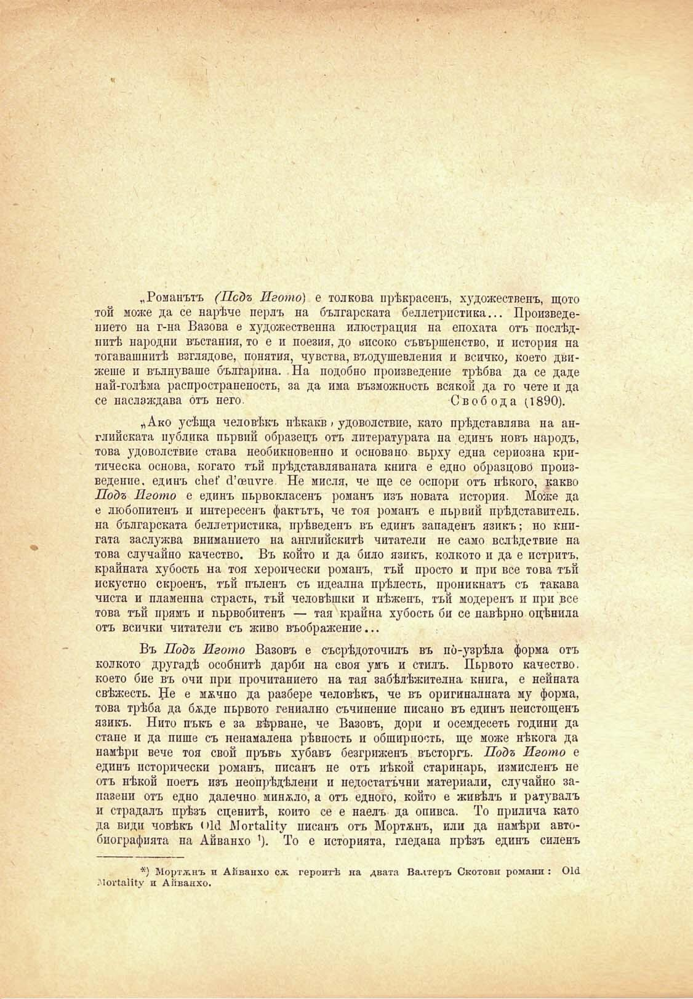

„Романътъ (Подъ Игото) е толкова прѣкрасенъ, художественъ, щото той може да се нарѣче перлъ на българската беллетрнстика... Произведението на г-на Вазова е художествеппа илюстрация па епохата отъ послѣднитѣ народни въстания, то е и поезия, до високо съвършенство, и история на тогавашнитѣ взглядове, понятия, чувства, въодушевления и всичко, което движеше и вълнуваше българина. На подобно произведение трѣбва да се даде най-голѣма распрострапепость, за да има възможность всякой да го чете и да се наслаждава отъ него	Свобода (1890).

„Ако усѣща человѣкъ нѣкакв, удоволствие, като прѣдставлява на английската публика пьрвий образецъ отъ литературата па единъ новъ народъ, това удоволствие става необикновепно и основа но вьрху една сериозна критическа основа, когато тъй прѣдставляваната книга е едпо образцово произведение. единъ сѣеГ сГоецуге Не мисля, че ще се оспори отъ нѣкого, какво Подъ Игото е единъ пьрвокласенъ романъ изъ новата история. Може да е любопитенъ и интересенъ фактътъ, че тоя романъ е пьрвий прѣдставитель, на българската беллетрнстика, прѣведенъ въ единъ западенъ язикъ; но книгата заслужва вниманието на английскитѣ читатели не само вслѣдствие на това случайно качество. Въ който и да било язикъ, колкото и да е нетритъ, крайната хубость на тоя хероически романъ, тъй просто и при все това тъй искустно скроенъ, тъй пъленъ съ идеална прѣлесть, проникнатъ съ такава чиста и пламенна страсть, тъй человѣшки и нѣжепъ, тъй модеренъ и при все това тъй прямъ и първобитенъ — тая крайна хубость би се навѣрно оцѣнила отъ всички читатели съ живо въображение...

Въ Подъ Игото Вазовъ е съсрѣдоточилъ въ по́-узрѣла форма отъ колкото другадѣ особнитѣ дарби на своя умъ и стилъ. Пьрвото качество, което бие въ очи при прочитанието на тая забѣлѣжителна книга, е нейната свѣжесть. Це е мхчно да разбере человѣкъ, че въ оригиналната му форма, това трѣба да бѫде пьрвото гениално съчинение писано въ единъ неистощенъ язикъ. Нито пъкъ е за вѣрване, че Вазовъ, дори и осемдесеть години да стане и да пише съ ненамалена рѣвность и обширность, ще може нѣкога да намѣри вече тоя свой пръвъ хубавъ безгриженъ въсторгъ. Подъ Игото е единъ исторически романъ, писанъ пе отъ нѣкой старинарь, измисленъ не отъ нѣкой поегь изъ неопрѣдѣлени и недостатъчни материали, случайно запазени отъ едно далечно минжло, а отъ едного, който е живѣлъ и ратувалъ и страдалъ прѣзъ сценитѣ, който се е наелъ да опивса. То прилича като да види човѣкъ <>Ш МоНаШу писанъ отъ Мортжнъ, или да намѣри автобиографията па Айванхо ’). То е историята, гледана прѣзъ единъ силенъ

*) Мортлг.нъ и Айванхо с.к героитѣ па двата Валтеръ Скотови романи : 01(1 .'■1ог1аШу и Айванхо.

