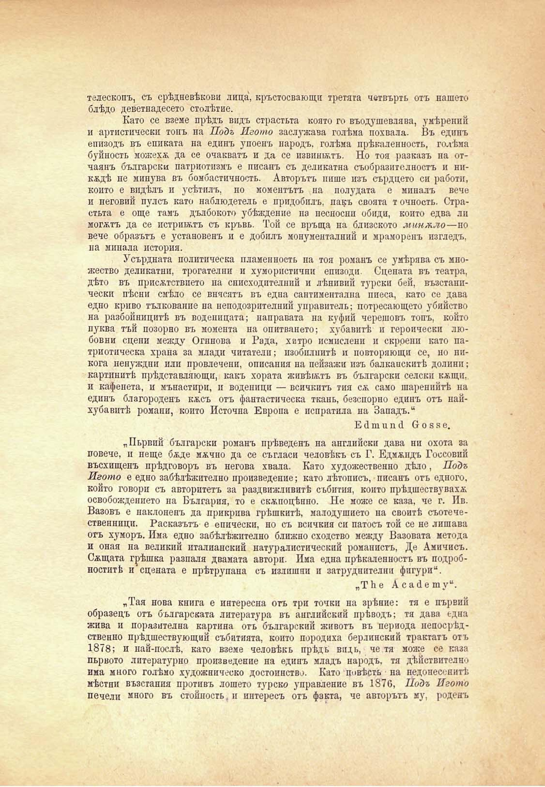

телескопъ, съ срѣдневѣкови лица, кръстосвающи третата четвърть отъ нашето блѣдо деветнадесето столѣтие.

Като се вземе прѣдъ видъ страстьта която го въодушевлява, умѣрений и артистически тонъ на Подъ Игото заслужава голѣма похвала. Въ единъ епизодъ въ епиката на единъ упоенъ народъ, голѣма прѣкаленность, голѣма буйность можехѫ да се очакватъ и да се извинятъ. Но тоя разказъ па отчаянъ български патриотнзмъ е писанъ съ деликатна съобразителность и никѫдѣ не минува въ бомбастичность. Авторътъ пише изъ сърдцето си работи, конто е видѣлъ и усѣтилъ, по моментътъ на полудата е миналъ вече и неговий пулсъ като наблюдетель е придобилъ, пакъ своята точность. Страстьта е още тамъ дълбокото убѣждение на несносни обиди, който едва ли могатъ да се истритжтъ съ кръвь. Той се връща на близското минало—но вече образътъ е установенъ и е добилъ монументалний и мраморенъ изгледъ, па минала история.

Усърдната политическа пламенность на тоя романъ се умѣрява съ множество деликатни, трогателни и хумористични епизоди. Сцената въ театри, дѣто въ присѫствието на снисходителний и лѣнивий турски бей, възстапически пѣсни смѣло се внясятъ въ една сантиментална пиеса, като се дава едно криво тълкование на неподозрителний управитель; потресающето убийство на разбойницитѣ въ воденицата; направата на куфий черешовъ топъ, който пуква тъй позорно въ момента на опитването; хубавитѣ и героически любовни сцени между Огннова и Рада, хитро исмислени и скроени като патриотическа храна за млади читатели; изобилнитѣ и повторяющи се, но никога ненуждни или провлечени, описания на пейзажи изъ балканскитѣ долини; картинитѣ прѣдставляющи, какъ хората живѣятъ въ български селски кжщи, и кафенета, и мънастири, и воденици — всичкптъ тия сѫ само шарениитѣ на единъ благороденъ кжсъ отъ фантастическа ткань, безспорно единъ отъ найхубавптѣ романи, копто Неточна Европа е испратила на Западъ.“

Е й т и и й бозке.

„Пьрвий български романъ прѣведенъ па английски дава ни охота за повече, и неще бѫде мжчно да се съгласи человѣкъ съ Г. Едмжпдъ Госсовий въсхищенъ прѣдговоръ въ негова хвала. Като художественно дѣло, Подъ Игото е едно забѣлѣжително произведение; като лѣтописъ, писанъ отъ сдного, който говори съ авторитетъ за раздвижливитѣ събития, който прѣдшествувахѫ освобождението на България, то е скжпоцѣнно. Не може се каза, че г. Ив. Вазовъ е наклоненъ да прикрива грѣшкитѣ, малодушието на своитѣ съотечественници. Расказътъ е епически, но съ всичкия си патосъ той се не лишава отъ хуморъ. Има едно забѣлѣжително ближно сходство между Базовата метода и оная на великий италианский натуралистический романисгь, Де Амичисъ. Сжщата грѣшка разпаля двамата автори. Има една прѣкаленность въ подробноститѣ и сцената е прѣтрупана съ излишни и затруднителни фигури“.

„Т Ь е А с а (1 е п1 у“.

„Тая нова книга е интересна отъ три точки па зрѣние: тя е първий образецъ отъ българската литература въ английский прѣводъ; тя дава една жива и поразителна картина отъ българский животъ въ периода непосрѣдственно прѣдшествующий събитията, който породиха берлинский трактатъ отъ 1878; и най-послѣ, като вземе человѣкь прѣдъ видь, че тя може се каза пьрвото литературно произведение па единъ младъ народъ, тя дѣйствителпо има много голѣмо художническо достойнство. Като повѣсть на недоносенитѣ мѣстни възсгания противъ лошето турско управление въ 1876, Подъ Игото печели много въ стойность, и интересъ отъ факта, че авторътъ му, роденъ

