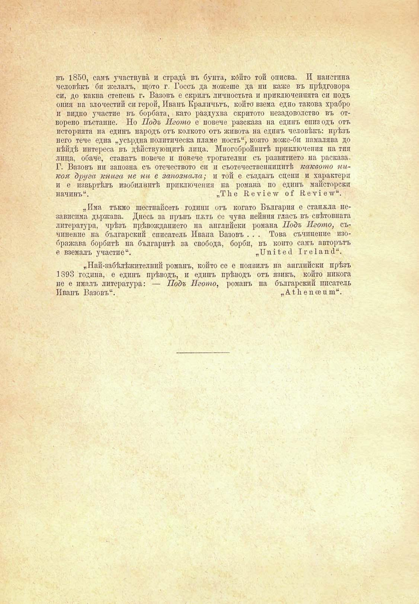

въ 1850, самъ участвува и страда въ бунта, кбйто той описва. И наистина человѣкъ би желалъ, щото г. Госсъ да можеше да ни каже въ прѣдговора си, до каква степень г. Вазовъ е скрилъ личностьта и приключенията си подъ ония на злочестий си герой, Иванъ Краличьтъ, който взема едпо такова храбро и видно участие въ борбата, като раздухва скритото незадоволство въ отворено въстание. Но Подъ Игото е повече разсказа на единъ епизодъ отъ историята па едпнъ народъ отъ колкото отъ живота на единъ человѣкъ: прѣзъ него тече една „усърдна политическа пламе пость“, която може-би намалява до нѣйдѣ интереса въ дѣйствующитѣ лица. Многобройнитѣ приключения па тия лица, обаче, ставатъ повече и повече трогателни съ развитието на расказа. Г. Вазовъ ни запозна съ отечеството си и съотечественнипитѣ каквото никоя друга книга не ни е запознаха; и той е създалъ сцени и характери н е извъртѣлъ изобилнитѣ приключения па романа по единъ майсторски начинъ“.	„Тйе Ксу1е^ о? В,еу1е\у“.

„Има тъкмо шестнайсеть години отъ когато България е стапяла независима държава. Днесъ за пръвъ пжть се чува нейния гласъ въ свѣтовната литература, чрѣзъ прѣвождапието па английски романа Подъ Игото, съчинение па българский описатель Ивана Вазовъ . . . Това съчинение изображава борбитѣ па българитѣ за свобода, борби, въ който самъ авторътъ е вземалъ участие„И и 1 ѣ е И I г е 1 а и й“.

„Най-забѣлѣжителний романъ, който се е появилъ па английски прѣзъ 1393 година, е едипъ прѣводъ, и единъ прѣводъ отъ язикъ, който никога пе е ималъ литература: — Подъ Игото, романъ па българский писатель Иванъ Вазовъ“.	„А.1 йепсепш“.

